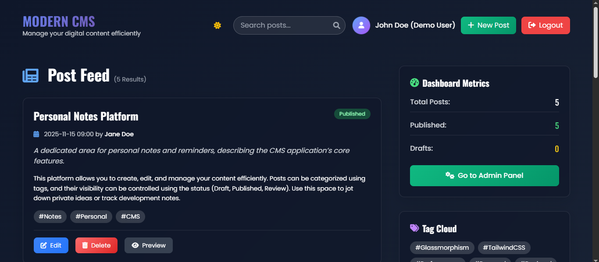
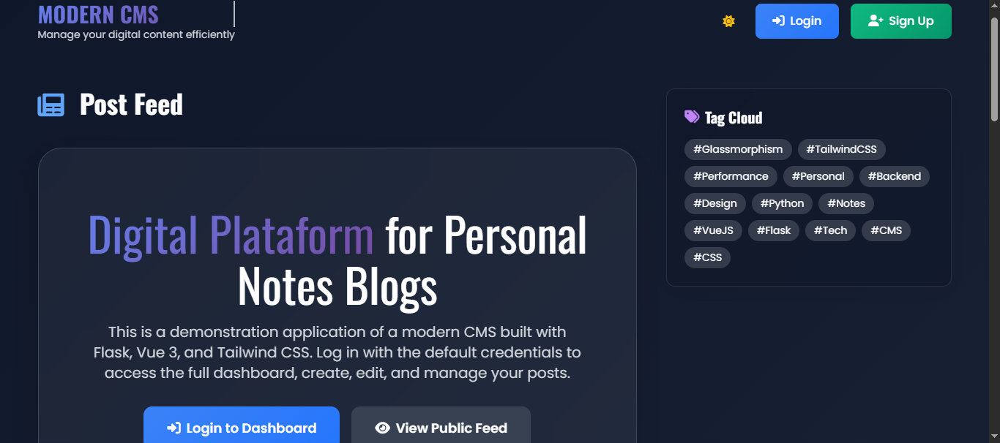

# 🚀 Modern CMS & Blog Platform

> **Developed with AI Assistance** 🤖 + **Human Expertise** 👨‍💻

A robust, full-stack blogging and Content Management System (CMS) application built using the high-performance **FastAPI** framework for the backend and a modern UI/UX approach. This project exemplifies effective human-AI collaboration in software development.

---

## 🌐 Live Application & Key Views

Explore the live application and see the system's key interfaces:

**🔗 Live URL:** [https://modern-blog-tkzl.onrender.com/](https://modern-blog-tkzl.onrender.com/)
**📚 API Documentation:** [https://modern-blog-tkzl.onrender.com/docs](https://modern-blog-tkzl.onrender.com/docs)

### Application Screenshots

*The CMS user interface showing the main feed, dashboard, and content management tools.*

---

## ✨ Key Features & Technology Stack

### 🛠 Technology Stack
| Component | Technology | Role |
| :--- | :--- | :--- |
| **Backend Framework** | Python 3.11, **FastAPI 0.100.0** | High-performance API and business logic. |
| **Database/ORM** | **SQLAlchemy 1.4.46**, PostgreSQL | Object-Relational Mapping and data persistence. |
| **Frontend** | HTML5, CSS3, **JavaScript** (Modern UI/UX) | User Interface design and interactivity. |
| **Security** | Werkzeug 2.3.7, BCrypt, CORS | Password hashing and secure connection management. |
| **Deployment** | Render.com, GitHub, PostgreSQL | Continuous integration and production environment. |

### 📈 Performance & Security
* ⚡ **FastAPI:** Utilized for high-performance and asynchronous (async) operations.
* 🗃️ **SQLAlchemy:** Ensures efficient and reliable database interactions.
* 🔒 **Werkzeug Security:** Implements robust password hashing for user data protection.
* 📱 **Responsive Design:** Optimized for seamless viewing and interaction across all devices.

## 🏗 Project Architecture

modern-blog/
├── main.py # FastAPI application
├── database.py # Database configuration
├── models/ # SQLAlchemy models & schemas
├── templates/ # HTML templates
├── static/ # CSS, JS, assets
├── requirements.txt # Dependencies
├── build.sh # Render deployment
└── runtime.txt # Python version

## 🚀 Development Journey
**AI-Human Collaboration:** This project was developed through iterative AI assistance combined with human oversight for architecture decisions, code review, and deployment.

**Development Milestones:**
1. Architecture design and technology selection
2. FastAPI backend with SQLAlchemy ORM
3. Database modeling (User and Post entities)
4. Authentication system implementation
5. Frontend integration with responsive design
6. Render.com deployment configuration

## 📦 API Endpoints
**Authentication:**
- POST /api/auth/register - User registration
- POST /api/auth/login - User login
- GET /api/auth/me - Get current user
- PUT /api/auth/profile - Update user profile

**Post Management:**
- GET /api/posts - Get all posts
- POST /api/posts - Create new post
- GET /api/posts/my-posts - Get user's posts
- GET /api/posts/{id} - Get specific post
- PUT /api/posts/{id} - Update post
- DELETE /api/posts/{id} - Delete post

**Analytics:**
- GET /api/dashboard/stats - Platform statistics
- GET /api/users/{id}/stats - User analytics

- 🌍 Deployment
Render.com Configuration:

Auto-deploy from GitHub main branch

Managed PostgreSQL database

Python 3.11 runtime

Build Command: ./build.sh

Start Command: python main.py

🤖 AI Development Insights
AI Contributions: Code generation, debugging, dependency management, optimization, documentation
Human Oversight: Architecture decisions, security implementations, deployment strategy, code quality

📈 Performance Features
⚡ FastAPI for high-performance async operations

🗃️ SQLAlchemy for efficient database operations

🔒 Werkzeug Security for password hashing

🌐 CORS Enabled for cross-origin requests

📱 Responsive Design for all devices

👨‍💻 Developer  
**Marcelo**  
[View GitHub Profile](https://github.com/MarceloAdan73)

"This project showcases how AI can accelerate development while maintaining code quality and architectural integrity."

⭐ Star this repo if you found it helpful!

🚀 Live Demo | 📚 API Docs
